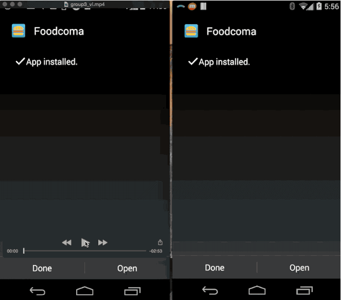

# Foodcoma

### Youtube video
<a href="https://www.youtube.com/watch?v=HgxEqx-ZMuM">Click here</a> 
<iframe width="420" height="315" src="https://www.youtube.com/embed/HgxEqx-ZMuM" frameborder="0" allowfullscreen></iframe>

### Demo

### Setup keystore for Google Maps (Must do)
- Download 'Ray-debug.keystore' from group's shared folder on google drive
- Rename is to 'debug.store' and place it in the project's root folder (e.g. Foodcoma/debug.keystore)